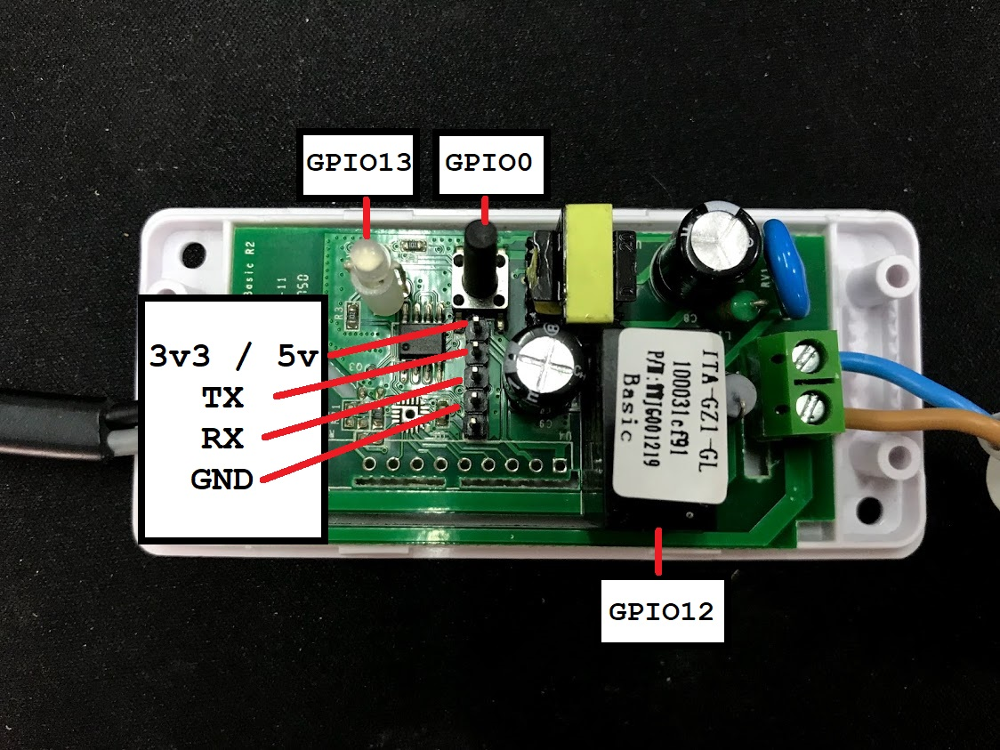

# SONOFF_Microgear
Sonoff is a smart plug that allows you to control via appliances on app. 
Sonoff use ESP8266 to connect wifi so we can upload code to this board.

Let's do it !!!


# Things used in this project !
1) Sonoff WiFi Smart Switch x 1
2) FT232RL USB to Serial x 1
3) USB Cable x 1
4) Wire Female to Female x 1

# Library & Service
1) ESP8266 microgear library
2) NETPIE.io account [NETPIE.io](https://www.netpie.io)

# Schematics

# Code
## Step 1: edit WiFi password and netpie authentication
```arduino
const char* ssid     = "your wifi name";
const char* password = "yout wifi password";

#define APPID   "NETPIE APP ID"
#define KEY     "NETPIE KEY"
#define SECRET  "NETPIE SECRET"
#define ALIAS   "Device Name"
```
## Step 2: when recieve message
```arduino
/* If a new message arrives, do this */
void onMsghandler(char *topic, uint8_t* msg, unsigned int msglen) {
  char strMsg[msglen];
  for (int i = 0; i < msglen; i++) {
    strMsg[i] = (char)msg[i];
  }

  String msgStr = String(strMsg).substring(0, msglen);
  String strTopic = (char *)topic;

  Serial.print("Incoming Topic --> ");
  Serial.println(strTopic);
  Serial.print("Incoming message --> ");
  Serial.println(msgStr);
  Serial.println("");
  Serial.println("");

  if (msgStr == "ON") {
    digitalWrite(SONOFF_RELAY, HIGH);
    digitalWrite(SONOFF_LED, LOW);
    relayState = true;
  }
  if (msgStr == "OFF") {
    digitalWrite(SONOFF_RELAY, LOW);
    digitalWrite(SONOFF_LED, HIGH);
    relayState = false;
  }
}
```
## Step 3: publish data to netpie.io
```arduino
microgear.publish("/gearname/Sonoff001/status", "Connectecd");
microgear.publish("/gearname/Sonoff001/relayState", String(relayState));
```

# All code
```arduino
/*  NETPIE ESP8266 basic sample                            */
/*  More information visit : https://netpie.io             */

#include "ESP8266WiFi.h"
#include "MicroGear.h"

const char* ssid     = "your wifi name";
const char* password = "yout wifi password";

#define APPID   "NETPIE APP ID"
#define KEY     "NETPIE KEY"
#define SECRET  "NETPIE SECRET"
#define ALIAS   "Device Name"

#define SONOFF_BUTTON 0
#define SONOFF_RELAY  12
#define SONOFF_LED    13

WiFiClient client;

boolean relayState = false;
int timer = 0;
MicroGear microgear(client);

/* If a new message arrives, do this */
void onMsghandler(char *topic, uint8_t* msg, unsigned int msglen) {
  char strMsg[msglen];
  for (int i = 0; i < msglen; i++) {
    strMsg[i] = (char)msg[i];
  }

  String msgStr = String(strMsg).substring(0, msglen);
  String strTopic = (char *)topic;

  Serial.print("Incoming Topic --> ");
  Serial.println(strTopic);
  Serial.print("Incoming message --> ");
  Serial.println(msgStr);
  Serial.println("");
  Serial.println("");

  if (msgStr == "ON") {
    digitalWrite(SONOFF_RELAY, HIGH);
    digitalWrite(SONOFF_LED, LOW);
    relayState = true;
  }
  if (msgStr == "OFF") {
    digitalWrite(SONOFF_RELAY, LOW);
    digitalWrite(SONOFF_LED, HIGH);
    relayState = false;
  }
}

void onFoundgear(char *attribute, uint8_t* msg, unsigned int msglen) {
  Serial.print("Found new member --> ");
  for (int i = 0; i < msglen; i++)
    Serial.print((char)msg[i]);
  Serial.println();
}

void onLostgear(char *attribute, uint8_t* msg, unsigned int msglen) {
  Serial.print("Lost member --> ");
  for (int i = 0; i < msglen; i++)
    Serial.print((char)msg[i]);
  Serial.println();
}

/* When a microgear is connected, do this */
void onConnected(char *attribute, uint8_t* msg, unsigned int msglen) {
  Serial.println("Connected to NETPIE...");
  /* Set the alias of this microgear ALIAS */
  microgear.setAlias(ALIAS);
}


void setup() {
  /* Add Event listeners */
  pinMode(SONOFF_BUTTON, INPUT_PULLUP);
  pinMode(SONOFF_RELAY, OUTPUT);
  pinMode(SONOFF_LED, OUTPUT);

  /* Call onMsghandler() when new message arraives */
  microgear.on(MESSAGE, onMsghandler);

  /* Call onFoundgear() when new gear appear */
  microgear.on(PRESENT, onFoundgear);

  /* Call onLostgear() when some gear goes offline */
  microgear.on(ABSENT, onLostgear);

  /* Call onConnected() when NETPIE connection is established */
  microgear.on(CONNECTED, onConnected);

  Serial.begin(115200);
  Serial.println("Starting...");

  /* Initial WIFI, this is just a basic method to configure WIFI on ESP8266.                       */
  /* You may want to use other method that is more complicated, but provide better user experience */
  if (WiFi.begin(ssid, password)) {
    while (WiFi.status() != WL_CONNECTED) {
      delay(500);
      Serial.print(".");
      digitalWrite(SONOFF_LED, !digitalRead(SONOFF_LED));
    }
  }

  Serial.println("WiFi connected");
  Serial.println("IP address: ");
  Serial.println(WiFi.localIP());

  /* Initial with KEY, SECRET and also set the ALIAS here */
  microgear.init(KEY, SECRET, ALIAS);

  /* connect to NETPIE to a specific APPID */
  microgear.connect(APPID);

  digitalWrite(SONOFF_RELAY, HIGH);
  digitalWrite(SONOFF_LED, HIGH);
}

void loop() {
  /* To check if the microgear is still connected */
  if (microgear.connected()) {
    /* Call this method regularly otherwise the connection may be lost */
    microgear.loop();

    if (timer >= 5000) {
      /* Chat with the microgear named ALIAS which is myself */
      microgear.publish("/gearname/Sonoff001/status", "Connectecd");
      microgear.publish("/gearname/Sonoff001/relayState", String(relayState));
      timer = 0;
    }
    else timer += 100;
  }
  else {
    Serial.println("connection lost, reconnect...");
    if (timer >= 5000) {
      microgear.connect(APPID);
      timer = 0;
    }
    else timer += 100;
  }
  delay(100);
}
```
