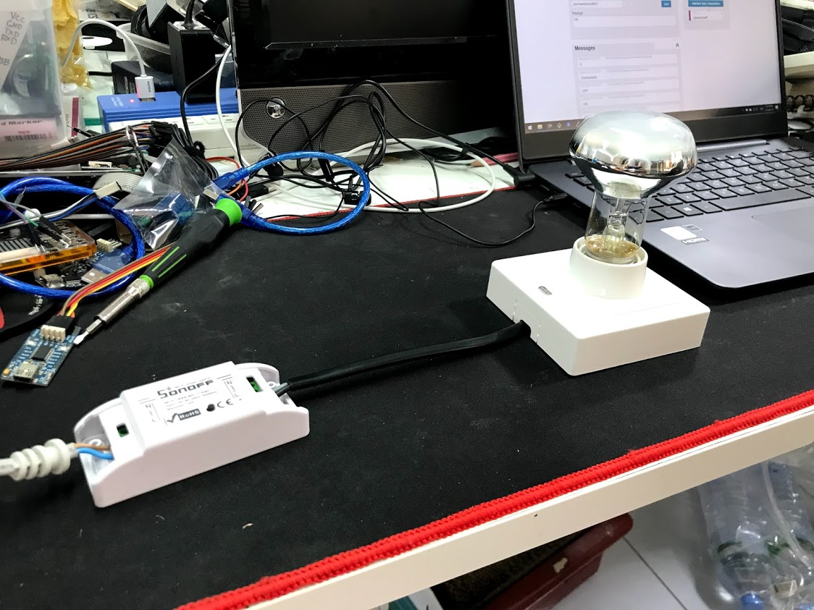

# Sonoff Microgear
Sonoff is a smart plug that allows you to control via appliances on app. 
Sonoff use ESP8266 to connect wifi so we can upload code to this board.

Let's do it !!!


# Things used in this project !
1) Sonoff WiFi Smart Switch x 1
2) FT232RL USB to Serial x 1
3) USB Cable x 1
4) Wire Female to Female x 1

# Library & Service
1) [ESP8266 microgear library](https://github.com/netpieio/microgear-esp8266-arduino)
2) [NETPIE.io account](https://www.netpie.io)

# Schematics

# Code
## Step 1: edit WiFi password and netpie authentication
```arduino
const char* ssid     = "your wifi name";
const char* password = "yout wifi password";

#define APPID   "NETPIE APP ID"
#define KEY     "NETPIE KEY"
#define SECRET  "NETPIE SECRET"
#define ALIAS   "Device Name"
```
## Step 2: when recieve message
```arduino
/* If a new message arrives, do this */
void onMsghandler(char *topic, uint8_t* msg, unsigned int msglen) {
  char strMsg[msglen];
  for (int i = 0; i < msglen; i++) {
    strMsg[i] = (char)msg[i];
  }

  String msgStr = String(strMsg).substring(0, msglen);
  String strTopic = (char *)topic;

  Serial.print("Incoming Topic --> ");
  Serial.println(strTopic);
  Serial.print("Incoming message --> ");
  Serial.println(msgStr);
  Serial.println("");
  Serial.println("");

  if (msgStr == "ON") {
    digitalWrite(SONOFF_RELAY, HIGH);
    digitalWrite(SONOFF_LED, LOW);
    relayState = true;
  }
  if (msgStr == "OFF") {
    digitalWrite(SONOFF_RELAY, LOW);
    digitalWrite(SONOFF_LED, HIGH);
    relayState = false;
  }
}
```
## Step 3: publish data to netpie.io
```arduino
microgear.publish("/gearname/Sonoff001/status", "Connectecd");
microgear.publish("/gearname/Sonoff001/relayState", String(relayState));
```
## Setp 4: netpie freeboard


